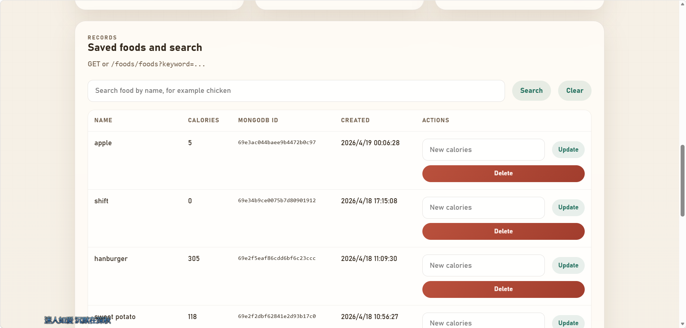

# Food Calorie Management System

一个基于 Node.js、Express、MongoDB 和 Mongoose 的食物热量管理系统。

这个项目实现了食物数据的基础增删改查，并额外提供了一个简单前端页面，方便直接在浏览器里操作接口、查看数据库结果和演示完整的数据流转。


## Screenshots
界面和功能的简单展示：




实现了基础的CRUD功能和模糊查询。
连接了本地MongoDB数据库：
### MongoDB Data View


## Tech Stack

- Node.js
- Express
- MongoDB
- Mongoose
- Vanilla HTML / CSS / JavaScript

## Core Features

- 创建食物记录
- 获取全部食物记录
- 按名称关键字搜索食物
- 更新食物热量
- 删除食物记录
- 前端页面直接对接后端 API

## Project Structure

```text
/config
  db.js
/models
  Food.js
/controllers
  foodController.js
/routes
  foodRoutes.js
/public
  index.html
  styles.css
  app.js
/scripts
  seedFoods.js
/docs/images
  show1.png
  show2.png
  db_show.png
server.js
```

## How To Run

1. 确保本地 MongoDB 已启动
2. 检查 `.env` 配置
3. 安装依赖
4. 启动服务

```bash
npm install
npm start
```

开发模式：

```bash
npm run dev
```

如果你想插入演示数据：

```bash
npm run seed
```

## Environment Variables

`.env` 示例：

```env
PORT=3000
MONGODB_URI=mongodb://127.0.0.1:27017/food-calorie-db
```

## API Examples

### Create Food

- Method: `POST`
- URL: `http://localhost:3000/food`

```json
{
  "name": "Chicken Breast",
  "calories": 165
}
```

### Get All Foods

- Method: `GET`
- URL: `http://localhost:3000/foods`

### Search Foods

- Method: `GET`
- URL: `http://localhost:3000/foods?keyword=chicken`

### Update Food Calories

- Method: `PATCH`
- URL: `http://localhost:3000/food/:id`

```json
{
  "calories": 180
}
```

### Delete Food

- Method: `DELETE`
- URL: `http://localhost:3000/food/:id`

