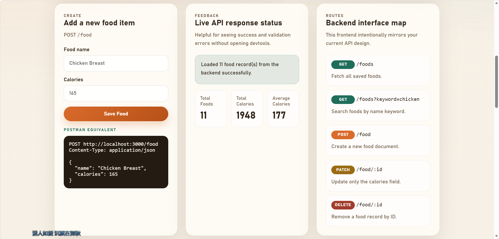
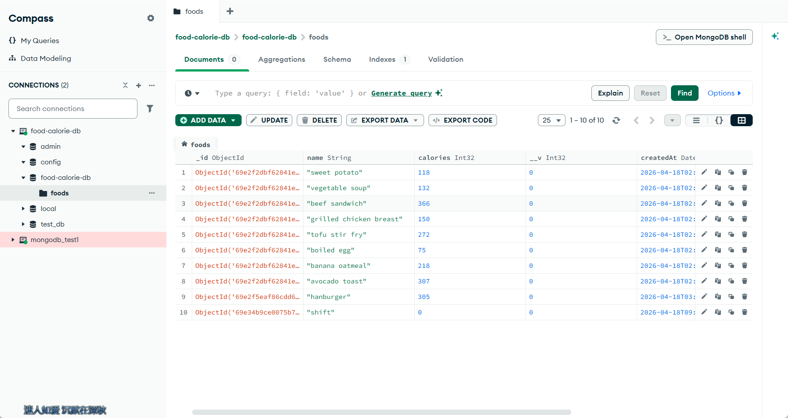

# Food Calorie Management System

一个基于 Node.js、Express、MongoDB 和 Mongoose 的食物热量管理系统。项目当前已经支持食物热量 CRUD、JWT 注册登录、当前用户查询、用户级 Food 数据隔离、管理员用户管理，以及登录失败限流。

后端代码按 `routes -> middleware -> controllers -> models -> DB` 分层组织，方便用 Postman 或前端页面理解完整请求链路。

## Screenshots
界面和功能的简单展示：




本地 MongoDB 数据视图：



## Tech Stack
- Node.js
- Express 5
- MongoDB 本地 `mongod`
- Mongoose
- JWT (`jsonwebtoken`)
- bcryptjs
- Vanilla HTML / CSS / TypeScript
- nodemon

## Core Features
- 用户注册、登录和 `GET /auth/me` 当前用户查询
- JWT Bearer Token 鉴权
- 登录失败限流，降低暴力破解风险
- 启动服务时根据 `.env` 初始化或更新管理员账号
- 创建、查询、搜索、更新和删除 Food 记录
- Food 数据按当前登录用户隔离
- 管理员查询、更新和删除用户
- 删除用户时同步删除该用户拥有的 Food 数据
- 管理员不能删除自己的管理员账号，避免锁死系统
- 前端页面直接对接后端 API

## Project Structure
```text
/config
  db.ts
  runtime.ts
  bootstrapAdmin.ts
/controllers
  authController.ts
  foodController.ts
  userController.ts
/middleware
  authMiddleware.ts
  adminMiddleware.ts
  loginRateLimitMiddleware.ts
/models
  Food.ts
  User.ts
/public
  index.html
  styles.css
  app.ts
/routes
  authRoutes.ts
  foodRoutes.ts
  userRoutes.ts
/tests
  auth-food-admin.test.ts
/utils
  permissions.ts
/docs/images
  show1_v1.png
  show2_v2.png
  db_show_1.png
server.ts
tsconfig.json
tsconfig.public.json
```

## How To Run
1. 确保本地 MongoDB 已启动。
2. 复制或检查 `.env`，确保数据库、JWT、管理员账号和登录限流配置完整。
3. 安装依赖并启动服务。

```bash
npm install
npm run build
npm start
```

开发模式：

```bash
npm run dev
```

运行主流程测试：

```bash
npm test
```

## Environment Variables
`.env` 示例：

```env
PORT=3000
MONGODB_URI=mongodb://127.0.0.1:27017/food-calorie-db
JWT_SECRET=replace-with-a-strong-secret
JWT_EXPIRES_IN=7d
LOGIN_RATE_LIMIT_WINDOW_MS=600000
LOGIN_RATE_LIMIT_MAX_ATTEMPTS=5
ADMIN_USERNAME=admin
ADMIN_EMAIL=admin@example.com
ADMIN_PASSWORD=change-this-password
```

`.env` 已在 `.gitignore` 中忽略，不要提交真实密码或 JWT 密钥。

## API Examples
默认服务地址为 `http://localhost:3000`。除注册和登录外，Food 接口需要普通用户 Bearer Token，用户管理接口需要管理员 Bearer Token。

### Register
- Method: `POST`
- URL: `http://localhost:3000/auth/register`
- Body:

```json
{
  "username": "alice",
  "email": "alice@example.com",
  "password": "123456"
}
```

### Login
- Method: `POST`
- URL: `http://localhost:3000/auth/login`
- Body:

```json
{
  "identifier": "alice",
  "password": "123456"
}
```

登录成功后会返回 `token`，后续请求放到请求头：

```text
Authorization: Bearer <token>
```

### Get Current User
- Method: `GET`
- URL: `http://localhost:3000/auth/me`
- Auth: Bearer Token

### Create Food
- Method: `POST`
- URL: `http://localhost:3000/food`
- Auth: Bearer Token
- Body:

```json
{
  "name": "Chicken Breast",
  "calories": 165
}
```

### Get All Foods
- Method: `GET`
- URL: `http://localhost:3000/foods`
- Auth: Bearer Token

### Search Foods
- Method: `GET`
- URL: `http://localhost:3000/foods?keyword=chicken`
- Auth: Bearer Token

### Update Food Calories
- Method: `PATCH`
- URL: `http://localhost:3000/food/:id`
- Auth: Bearer Token
- Body:

```json
{
  "calories": 180
}
```

### Delete Food
- Method: `DELETE`
- URL: `http://localhost:3000/food/:id`
- Auth: Bearer Token

### Get Users
- Method: `GET`
- URL: `http://localhost:3000/users`
- Auth: Admin Bearer Token

### Get User By ID
- Method: `GET`
- URL: `http://localhost:3000/users/:id`
- Auth: Admin Bearer Token

### Update User
- Method: `PATCH`
- URL: `http://localhost:3000/users/:id`
- Auth: Admin Bearer Token
- Body:

```json
{
  "username": "alice2",
  "email": "alice2@example.com",
  "role": "user",
  "password": "new-password"
}
```

### Delete User
- Method: `DELETE`
- URL: `http://localhost:3000/users/:id`
- Auth: Admin Bearer Token

## Request Flow
以创建 Food 为例：

```text
Request -> foodRoutes -> authMiddleware -> foodController.createFood -> Food model -> MongoDB -> Response
```

管理员用户管理链路：

```text
Request -> userRoutes -> authMiddleware -> adminMiddleware -> userController -> User/Food models -> MongoDB -> Response
```
